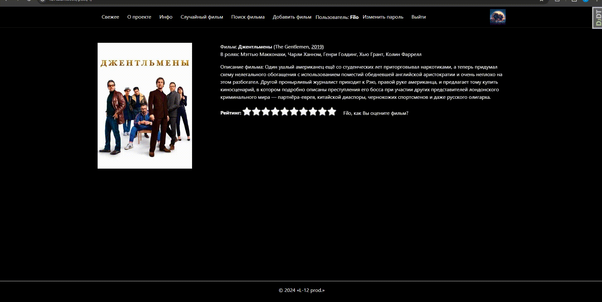

# Проект MovieMosaic с БД фильмов/сериалов [В разработке]

## Описание

Стандартный сайт с базой фильмов, сериалов, игр. На данный момент можно выполнять поиск по жанру, году. Реализована возможность довериться рандому и получить случайный фильм, который соответствует выбранному жанру.

### Версия от 04.05.2024



### Главная страница


### Случайный фильм


### Поиск по жанру


### Как запустить проект
Устанавливаем виртуальное окружение:

```bash
python -m venv venv
```

Активируем виртуальное окружение:

```bash
. venv/Scripts/activate
```

> Для деактивации виртуального окружения выполним (после работы):
> ```bash
> deactivate
> ```

Устанавливаем зависимости:

```bash
python -m pip install --upgrade pip
```
```bash
pip install -r requirements.txt
```

Применяем миграции:

```bash
python manage.py makemigrations
python manage.py migrate
```

Создаем супер пользователя:

```bash
python manage.py createsuperuser
```
## Стек проекта

- Python 3.9.10
- Django==2.2.28
- mixer==7.1.2
- Pillow==9.0.1
- pytest==6.2.4
- pytest-django==4.4.0
- pytest-pythonpath==0.7.3
- requests==2.26.0
- six==1.16.0
- sorl-thumbnail==12.7.0
- Pillow==9.0.1
- django-environ==0.8.1

Автор: [Игорь Любаев](https://github.com/Igor-L12)